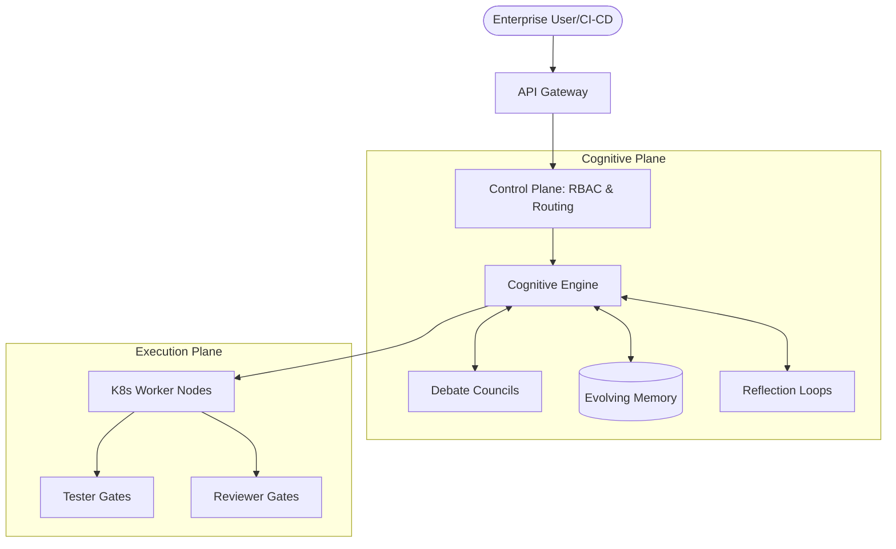

  

  <h1>AIOS: The Autonomous Engineering Operating System</h1>
  
<strong>Production-Grade AI Orchestration for the Modern Enterprise</strong>

  

    
    
    
  

  

    <a href="#vision">Vision</a> •
    <a href="#value-propositions">Value Propositions</a> •
    <a href="#evolution">The AIOS Evolution</a> •
    <a href="#architecture">Architecture Overview</a> •
    <a href="#commercial-readiness">Commercial Readiness</a>
  

---

## 🚀 Vision

Welcome to **AIOS**, the premier **Production-Grade Autonomous Engineering Operating System**. 

AIOS is no longer merely a collection of agents—it is a unified, enterprise-grade cognitive platform designed to revolutionize how engineering organizations build, maintain, and scale software. By orchestrating a symphony of intelligent agents endowed with self-evolving memory, dynamic debate councils, and rigorous self-correction loops, AIOS elevates AI from a copilot to an **autonomous engineering partner**. 

Designed for CTOs and Engineering Directors who demand uncompromising security, scalability, and intelligence, AIOS empowers your organization to accelerate delivery, enforce architectural standards, and eliminate technical debt at scale.

## 💎 Value Propositions

- **Autonomous Code Execution & Self-Correction:** Reduce MTTR and automate complex feature implementations through agents that not only write code but rigorously test, review, and self-correct their logic before merging.
- **Continuous Cognitive Evolution:** The system learns from every interaction. Through Reflection Loops and Agent Memory Evolution, AIOS gets continuously smarter, adapting its strategies to your proprietary codebase.
- **Enterprise-Grade Governance:** Multi-tenant architecture with strict Role-Based Access Control (RBAC) ensures that your IP remains secure. Granular permissions dictate exactly what each agent—and each human—can see and do.
- **Infinite Scalability:** Built as a Kubernetes-native platform with a robust API Gateway, AIOS effortlessly scales from isolated prototyping environments to massive, multi-repository enterprise deployments.

---

## 🧬 The AIOS Evolution

AIOS has matured through a rigorous, proven development lifecycle to meet the exacting standards of the modern enterprise.

### Phase 1: Core Agent Framework
The foundation of autonomous reliability. 
* **Self-Correction Loops:** Agents autonomously detect errors, iterate, and refine their outputs.
* **Reviewer & Tester Gates:** Mandatory algorithmic and LLM-driven quality gates ensure no code is shipped without comprehensive testing and architectural review.

### Phase 2.5: AIOS Intelligence Core
Transforming automation into true cognition.
* **Cognitive Engine:** Deep contextual understanding of entire engineering ecosystems.
* **Intelligent Task Routing:** Dynamic delegation of tasks to the most suitable agent based on current load, specialized capabilities, and historical performance.
* **Agent Reputation System:** A zero-trust trust model where agents build reputation based on their success rates, influencing future task routing.

### Phase 2.75: Self-Evolving Layer
The leap from static intelligence to dynamic learning.
* **Agent Debate Councils:** Complex architectural decisions are sent to a council of specialized agents (e.g., Security, Performance, Scalability) that debate and form consensus before execution.
* **Reflection Loops:** Post-mortem analysis by the agents on their own performance, leading to optimized strategies for future tasks.
* **Agent Memory Evolution:** Persistent, evolving state where agents build long-term memory of past decisions, codebase quirks, and organizational patterns.

### Phase 3: Enterprise Platform
Ready for mission-critical, large-scale deployments.
* **Role-Based Access Control (RBAC):** Comprehensive identity and access management for both human users and AI agents.
* **Multi-Tenancy:** Secure isolation for different teams, projects, or client organizations within a single AIOS deployment.
* **Kubernetes Native:** Containerized, orchestrated, and resilient. Deploy seamlessly into your existing K8s clusters.
* **API Gateway:** Centralized management of all incoming requests, rate limiting, and routing, providing a single pane of glass for API governance.

---

## 🏗️ Architecture Overview

AIOS utilizes a highly decoupled, domain-driven architecture that separates cognition from execution, all secured behind enterprise perimeters.

- **The Cognitive Plane:** Houses the Cognitive Engine, Agent Memory Evolution, and Debate Councils. It evaluates intent and strategizes execution.
- **The Execution Plane:** Ephemeral, sandboxed worker nodes (Kubernetes Pods) that safely execute code, run tests, and perform side effects.
- **The Control Plane:** The API Gateway, RBAC module, and Multi-tenant orchestrator that manage traffic, enforce permissions, and route tasks intelligently.

## 🏢 Commercial Readiness

AIOS is battle-tested and deployment-ready for enterprise environments. Whether you are modernizing legacy systems, automating QA, or seeking a 10x multiplier on your engineering throughput, AIOS delivers.

- **Deployment Models:** On-Premise, VPC Peering, or Managed SaaS.
- **Compliance:** Designed to facilitate SOC2, GDPR, and HIPAA compliance through deep audit logging and localized execution options.
- **Integration Ecosystem:** Out-of-the-box integrations with GitHub, GitLab, Jira, Datadog, and major CI/CD pipelines.

  <i>Step into the future of software engineering. Deploy AIOS today.</i>

