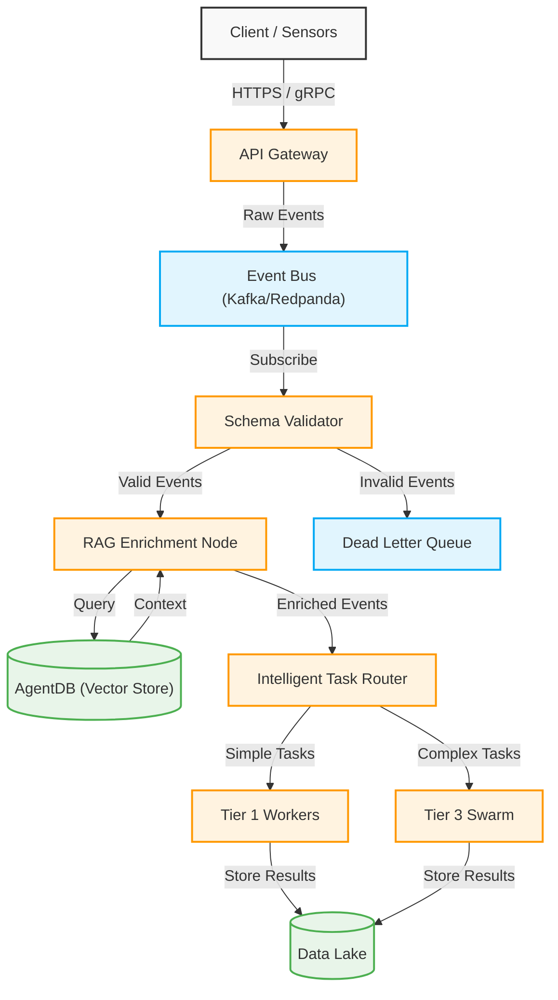

# Event-Driven Ingestion Pipeline

The AIOS Event-Driven Ingestion Pipeline is designed for high-throughput, low-latency processing. It safely ingests real-time data streams, enriches them using RAG context, and distributes events to the Multi-Agent Swarm.

## Architecture Diagram

## Key Components

1. **API Gateway**: Handles rate limiting, authentication, and initial payload acceptance.
2. **Event Bus**: The resilient backbone ensuring zero data loss and decoupled consumer scaling.
3. **Schema Validator**: Drops or reroutes malformed data to the Dead Letter Queue.
4. **RAG Enrichment Node**: Interrogates the AgentDB to attach semantic context to raw events.
5. **Intelligent Task Router**: Decides which LLM tier or Swarm agent is best equipped to handle the event.
