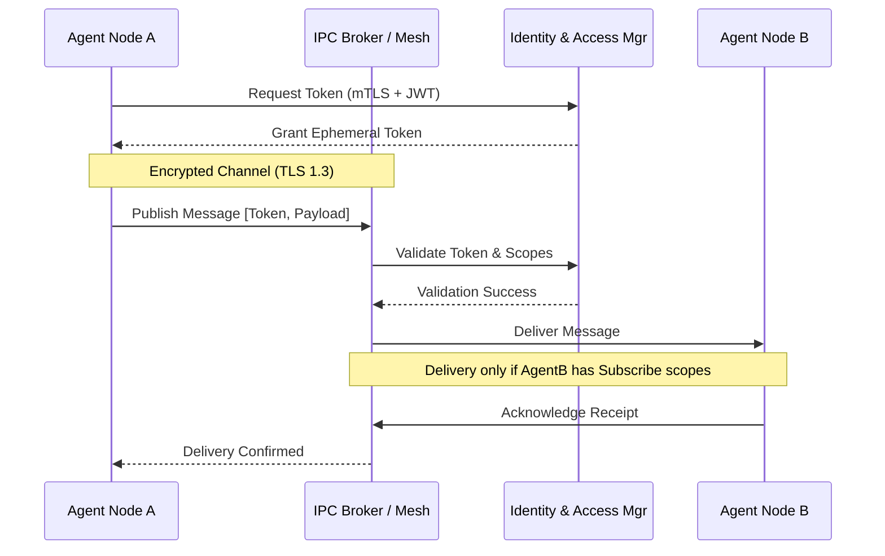

# IPC Security Architecture

AIOS utilizes a Zero-Trust Inter-Process Communication (IPC) model. Agents, background workers, and memory components are strictly isolated, communicating solely over authenticated, encrypted channels.

## Security Diagram

## Core Security Pillars

- **mTLS Everywhere**: All node-to-node communication is encrypted at the transport layer.
- **Ephemeral Identity**: Agents are issued short-lived JWTs, reducing the attack surface.
- **Sandboxing**: Agents run in restricted environments with no direct network access; all external connections route through a hardened gateway.
- **Payload Inspection**: The IPC Broker scans payloads for PII and restricted content before routing.
