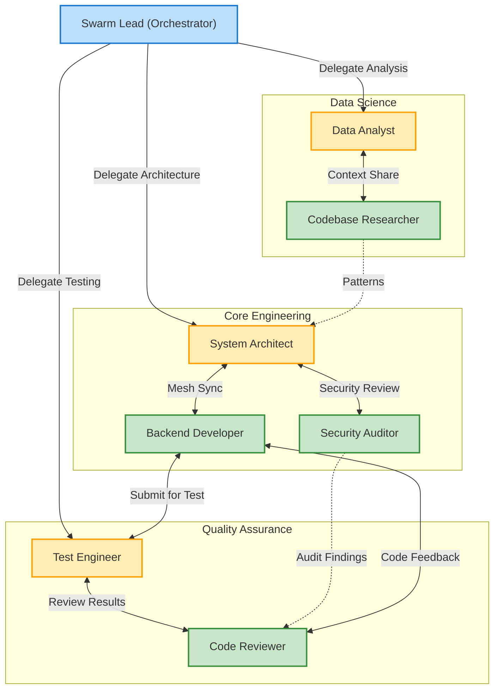

# Multi-Agent Swarm Topology

The AIOS Swarm uses a **Hierarchical-Mesh** topology to balance strict oversight with dynamic, parallel collaboration.

## Topology Diagram

## Architectural Highlights

- **Hierarchical Oversight**: The `Swarm Lead` orchestrates the high-level goals, delegating complex sub-tasks to domain-specific Managers.
- **Mesh Collaboration**: Workers within and across domains communicate directly (`SendMessage`) without continually bottlenecking the Lead.
- **Anti-Drift Mechanisms**: Managers enforce adherence to the original goal, preventing agents from falling into hallucination loops.
- **Dynamic Spawning**: The Swarm can scale horizontally, spawning new workers when the task queue grows.
